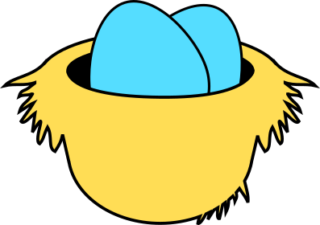
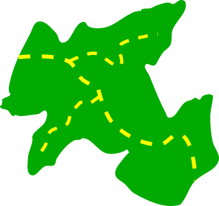
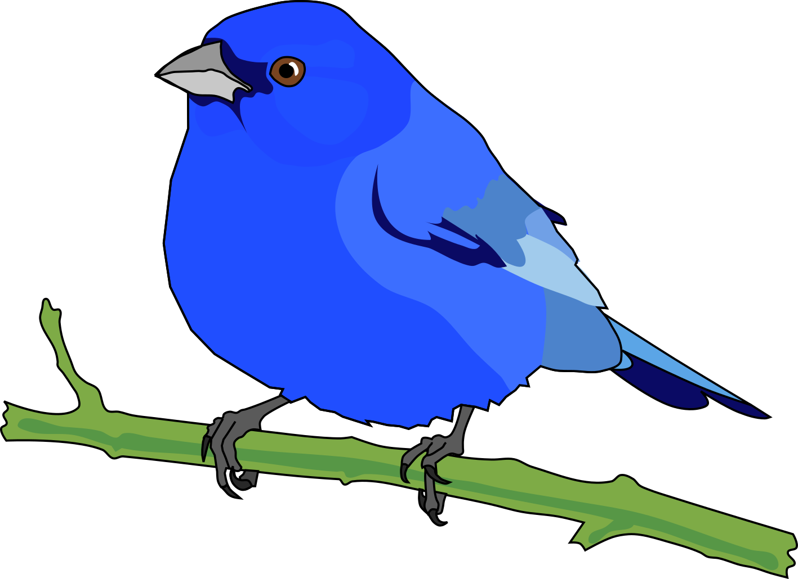
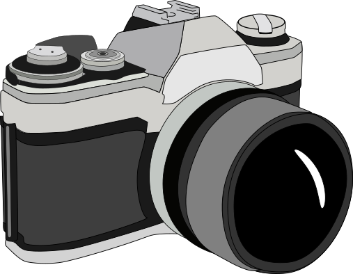

```{r}
#| echo: false

# Inline the host-page CSS, read fresh each render (embedded, so no browser can
# serve a stale cached stylesheet).

htmltools::tags$style(
  htmltools::HTML(
    paste(
      readLines(here::here("outputs/nest_app/field_map_app.css")),
      collapse = "\n"
    )
  )
)
```

```{r}
#| echo: false
#| message: false
#| warning: false

source(here::here("outputs/nest_app/make_field_map.R"))

map_tracking
```

```{=html}
<!-- Phase 1 data/shell decoupling: load the externalized map-data payloads.
     These run after the embedded window.field* assignments above (identical
     data, harmless overwrite) and before field_map_app.js / map_weather.js
     consume the globals. -->
<script src="field_patches.js"></script>
<script src="field_icons.js"></script>
<script src="field_offline_tiles.js"></script>
<script src="field_data.js"></script>
```

```{=html}
<!-- Portrait lock: on a phone in landscape this covers everything and asks the
     user to rotate. The app is designed for portrait use only. -->
<div id="rotateNotice" class="rotate-notice">
  <div class="rotate-notice-inner">
    <div class="rotate-notice-icon">&#x21BB;</div>
    <div>Please rotate your device to portrait.</div>
  </div>
</div>

<!-- Waypoint navigation: a top banner (target / distance / bearing + Cancel)
     while navigating, and a centered "You have arrived!" popup. -->
<div id="navBanner" class="nav-banner" hidden>
  <div class="nav-banner-info">
    <span id="navTarget" class="nav-banner-target">&mdash;</span>
    <span class="nav-banner-stats">
      <span id="navDist">-- m</span> &middot; <span id="navBrg">--&deg;</span>
    </span>
  </div>
  <button type="button" id="navCancelBtn" class="nav-banner-cancel">Cancel</button>
</div>

<div id="navArrived" class="nav-arrived" hidden>
  <div class="nav-arrived-box">
    <div class="nav-arrived-title">You have arrived!</div>
    <div id="navArrivedName" class="nav-arrived-name"></div>
    <button type="button" id="navArrivedCancel" class="field-button">
      Cancel navigation
    </button>
  </div>
</div>
```

<!-- Menu overlay: holds several screens; only the .is-active one is shown.
     The bottom bar (a sibling, further down) stays visible on every screen.
     Each screen is a Quarto fenced div; its form controls -- buttons, inputs,
     selects, toggle switches -- have no Markdown equivalent, so they stay as
     raw HTML inside `{=html}` blocks. -->
     
:::: {#fieldMenuOverlay .field-menu-overlay}

::: {.field-screen .is-active data-name="main"}
```{=html}
    <div class="field-menu-panel">
      <!-- Patch filter: choose a patch to show only features within 50 m of it.
           Options are populated from the patch names by field_map_app.js.
           The "Patch" label text is omitted -- context makes it obvious. -->
      <label class="field-field-label">
        <select id="patchSelect" class="field-patch-select">
          <option value="__all__">All patches</option>
        </select>
        <button type="button" id="patchPickerBtn" class="field-input field-patch-picker-btn">All patches</button>
      </label>

      <div class="field-tilegrid">
        <button type="button" class="field-tile" data-screen="schedule">
          
          <span>Schedule</span>
        </button>
        <button type="button" class="field-tile" data-screen="nests">
          
          <span>Nests</span>
        </button>
        <button type="button" class="field-tile" data-screen="addwaypoint">
          
          <span>Add waypoint</span>
        </button>
        <button type="button" class="field-tile" data-screen="waypointmgr">
          
          <span>Waypoint manager</span>
        </button>
        <button type="button" class="field-tile" data-screen="tracks">
          
          <span>Add track</span>
        </button>
        <button type="button" class="field-tile" data-screen="trackmgr">
          
          <span>Track manager</span>
        </button>
        <button type="button" class="field-tile" data-screen="mapoptions">
          
          <span>Map options</span>
        </button>
        <button type="button" class="field-tile" data-screen="speciesinfo">
          
          <span>Species info</span>
        </button>
        <button type="button" class="field-tile" data-screen="concealment">
          
          <span>Concealment photos</span>
        </button>
      </div>
    </div>
```
:::

::: {.field-screen data-name="concealment"}
```{=html}
    <div class="field-menu-panel">
      <div class="field-menu-title">Concealment photos</div>

      <label class="field-field-label">Nest (within 25 m)</label>
      <button type="button" id="concealNestBtn" class="field-input field-patch-picker-btn">Choose a nest</button>

      <div class="conceal-bearing" id="concealBearing">Bearing: --</div>

      <button type="button" id="concealCaptureBtn" class="field-button conceal-capture">Capture photo</button>
      <input type="file" id="concealCamera" accept="image/*" capture="environment" class="field-hidden-input">

      <div id="concealStatus" class="conceal-status"></div>

      <div id="concealEditor" class="conceal-editor" hidden>
        <div class="conceal-canvas-wrap"><canvas id="concealCanvas"></canvas></div>
        <div class="field-mgr-actions">
          <button type="button" id="concealUndoBtn" class="field-button">Undo</button>
          <button type="button" id="concealClearBtn" class="field-button">Clear</button>
        </div>
        <div class="field-mgr-actions">
          <button type="button" id="concealSaveBtn" class="field-button">Save photo</button>
          <button type="button" id="concealDiscardBtn" class="field-button field-button--danger">Discard</button>
        </div>
      </div>

      <div class="field-field-label">This session</div>
      <ul id="concealList" class="field-mgr-list"></ul>
    </div>
```
:::

::: {.field-screen data-name="mapoptions"}
```{=html}
    <div class="field-menu-panel">
      <div class="field-menu-title">Map options</div>
      <div class="field-section-title">Default options:</div>

      <label class="field-toggle">
        <input type="checkbox" id="todayToggle" class="field-toggle-input" checked>
        <span class="field-toggle-track">
          <span class="field-toggle-thumb"></span>
        </span>
        <span class="field-toggle-label">Subset to today's data</span>
      </label>

      <label class="field-toggle">
        <input type="checkbox" id="weatherToggle" class="field-toggle-input">
        <span class="field-toggle-track">
          <span class="field-toggle-thumb"></span>
        </span>
        <span class="field-toggle-label">Show weather</span>
      </label>

      <label class="field-toggle">
        <input type="checkbox" id="patchesToggle" class="field-toggle-input" checked>
        <span class="field-toggle-track">
          <span class="field-toggle-thumb"></span>
        </span>
        <span class="field-toggle-label">Include patch boundaries</span>
      </label>

      <label class="field-toggle">
        <input type="checkbox" id="samplingToggle" class="field-toggle-input" checked>
        <span class="field-toggle-track">
          <span class="field-toggle-thumb"></span>
        </span>
        <span class="field-toggle-label">Show sampling points</span>
      </label>

      <label class="field-toggle">
        <input type="checkbox" id="osmToggle" class="field-toggle-input">
        <span class="field-toggle-track">
          <span class="field-toggle-thumb"></span>
        </span>
        <span class="field-toggle-label">Include OpenStreetMap</span>
      </label>
    </div>
```
:::

::: {.field-screen data-name="addwaypoint"}
```{=html}
    <div class="field-menu-panel">
      <div class="field-menu-title">Add waypoint</div>

      <!-- Live position + heading + (averaging) accuracy. -->
      <div class="field-live-readout">
        <div>Longitude: <span id="wpLon">--</span></div>
        <div>Latitude: <span id="wpLat">--</span></div>
        <div>Bearing: <span id="wpBrg">--</span></div>

        <!-- Sample confidence: empty = poor accuracy, grows to the right (and
             shifts red -> dark green) as the averaged estimate improves. -->
        <div class="field-conf">
          <div class="field-conf-head">
            <span class="field-conf-title">Sample confidence</span>
            <span class="field-conf-stats">
              <span id="wpTimer">00:00</span> &middot;
              <span id="wpSamples">0 samples</span>
            </span>
          </div>
          <div class="field-conf-track">
            <div class="field-conf-fill" id="wpAccBar"></div>
          </div>
          <div class="field-conf-foot">
            Spatial accuracy: <span id="wpAccLabel">--</span> meters
          </div>
        </div>
      </div>

      <label class="field-field-label">Class
        <select id="wpClass" class="field-input">
          <option>Nest</option>
          <option>Landmark</option>
          <option>Path crossing</option>
          <option value="Boundary">Boundary marker</option>
          <option>Other</option>
        </select>
      </label>

      <label class="field-field-label">Name
        <span class="field-name-input">
          <span id="wpNamePrefix" class="field-name-prefix"></span>
          <input type="text" id="wpName" class="field-input"
                 placeholder="Waypoint name" autocomplete="off">
        </span>
      </label>

      <label class="field-field-label">Note
        <textarea id="wpNote" class="field-input" rows="3"
                  placeholder="Describe the waypoint"></textarea>
      </label>

      <label class="field-field-label">Photo
        <!-- No `capture` attribute: the OS offers Take Photo *or* Choose File. -->
        <input type="file" id="wpPhoto" class="field-input" accept="image/*">
      </label>
      <div id="wpPhotoPreview" class="field-photo-preview"></div>

      <div class="field-field-label">Marker color</div>
      <!-- Color swatches (ROYGBIV) are injected by field_map_app.js. -->
      <div id="wpColorRow" class="field-color-row"></div>

      <div class="field-waypoint-actions">
        <button type="button" id="addWaypointSaveBtn" class="field-button">
          Save waypoint
        </button>
        <button type="button" id="addWaypointCancelBtn"
                class="field-button field-button--danger">
          Cancel
        </button>
      </div>

      <div id="addWaypointStatus" class="field-status" role="status"
           aria-live="polite"></div>
    </div>
```
:::

::: {.field-screen data-name="waypointmgr"}
```{=html}
    <div class="field-menu-panel">
      <div class="field-menu-title">Waypoint manager</div>

      <ul id="waypointList" class="field-waypoint-list"></ul>

      <div class="field-waypoint-actions">
        <button type="button" id="saveAllWaypointsBtn" class="field-button">
          Save waypoints
        </button>
        <button type="button" id="clearWaypointsBtn"
                class="field-button field-button--danger">
          Clear all
        </button>
      </div>
      <div id="waypointSyncStatus" class="field-status" role="status"
           aria-live="polite"></div>
    </div>
```
:::

::: {.field-screen data-name="tracks"}
```{=html}
    <div class="field-menu-panel">
      <div class="field-menu-title">Track</div>

      <label class="field-field-label">Activity
        <select id="trackActivity" class="field-input">
          <option value="nest_searching">Nest searching</option>
          <option value="new_path">New path</option>
          <option value="distributary">Distributary</option>
          <option value="other">Other</option>
        </select>
      </label>
      <label class="field-field-label">Track name
        <input type="text" id="trackName" class="field-input"
               placeholder="Track name" autocomplete="off">
      </label>
      <label class="field-field-label">Notes
        <textarea id="trackNote" class="field-input" rows="2"
                  placeholder="Notes about this track"></textarea>
      </label>

      <button type="button" id="trackToggleBtn" class="field-button">
        Start track
      </button>

      <!-- Live recording readout. -->
      <div class="field-track-readout">
        <div>Speed: <span id="trkSpeed">--</span> m/min</div>
        <div>Length: <span id="trkLen">--</span></div>
        <div>Start: <span id="trkStart">--</span></div>
        <div>Elapsed: <span id="trkClock">00:00</span></div>
        <div>Motion: <span id="trkRms">--</span></div>
      </div>

      <div id="trackStatus" class="field-status" role="status"
           aria-live="polite"></div>

      <div class="field-track-actions">
        <button type="button" id="saveTrackBtn" class="field-button" disabled>
          Save track
        </button>
        <button type="button" id="clearTrackBtn"
                class="field-button field-button--danger" disabled>
          Clear track
        </button>
      </div>

    </div>
```
:::

::: {.field-screen data-name="trackmgr"}
```{=html}
    <div class="field-menu-panel">
      <div class="field-menu-title">Track manager</div>

      <div class="field-section-title">Saved tracks:</div>
      <ul id="trackList" class="field-waypoint-list"></ul>
    </div>
```
:::

::: {.field-screen data-name="speciesinfo"}
```{=html}
    <div class="field-menu-panel">
      <div class="field-menu-title">Species info</div>
      <div class="field-doc-content" id="speciesInfoDoc">
```

```{r}
#| echo: false
#| warning: false
#| message: false

source(here::here("outputs/nest_app/species_info.R"))

cat(
  str_c(
    "window.fieldSpeciesHTML = ",
    jsonlite::toJSON(
      paste(as.character(species_info_panels), collapse = ""),
      auto_unbox = TRUE
    ),
    ";\n"
  ),
  file = here::here("outputs/nest_app/field_data.js"),
  append = TRUE
)
```

```{=html}
      </div>
    </div>
<script>(function(){var el=document.getElementById("speciesInfoDoc");if(el&&window.fieldSpeciesHTML)el.innerHTML=window.fieldSpeciesHTML;})();</script>
```
:::

::: {.field-screen data-name="nests"}
```{=html}
    <div class="field-menu-panel">
      <div class="field-menu-title">Nests</div>
      <div class="field-doc-content show-current-only" id="nestsDoc">
```

```{r}
#| echo: false
#| warning: false
#| message: false

source(here::here("outputs/nest_app/nests.R"))

cat(
  str_c(
    "window.fieldNestsHTML = ",
    jsonlite::toJSON(
      paste(as.character(nest_panels), collapse = ""),
      auto_unbox = TRUE
    ),
    ";\n"
  ),
  file = here::here("outputs/nest_app/field_data.js"),
  append = TRUE
)
```

```{=html}
      </div>
    </div>
<script>(function(){var el=document.getElementById("nestsDoc");if(el&&window.fieldNestsHTML)el.innerHTML=window.fieldNestsHTML;})();</script>
<script>
document.addEventListener("DOMContentLoaded", function () {
  var doc = document.getElementById("nestsDoc");
  if (!doc) return;
  var groupToggle = document.getElementById("nestGroupToggle");
  var currentToggle = document.getElementById("nestCurrentToggle");
  var allView = document.getElementById("nest-view-all");
  var patchView = document.getElementById("nest-view-patch");

  function applyGroup() {
    var grouped = groupToggle.checked;
    if (allView) allView.style.display = grouped ? "none" : "block";
    if (patchView) patchView.style.display = grouped ? "block" : "none";
  }

  function applyCurrent() {
    if (currentToggle.checked) doc.classList.add("show-current-only");
    else doc.classList.remove("show-current-only");
  }

  if (groupToggle) groupToggle.addEventListener("change", applyGroup);
  if (currentToggle) currentToggle.addEventListener("change", applyCurrent);

  applyGroup();
  applyCurrent();
});
</script>
<script>
(function () {
  function offlinePatch(layer) {
    if (layer._offlinePatched) return;
    layer._offlinePatched = true;
    var orig = layer.getTileUrl;
    layer.getTileUrl = function (coords) {
      var t = window.fieldOfflineTiles;
      if (t) {
        var key = coords.z + "/" + coords.x + "/" + coords.y;
        if (t[key]) return t[key];
      }
      return orig.call(this, coords);
    };
  }

  function nestPoint(nestId) {
    var pts = window.fieldMapPoints || [];
    for (var i = 0; i < pts.length; i++) {
      var p = pts[i];
      if (p.name === nestId && p.lat != null && p.lng != null &&
          !isNaN(p.lat) && !isNaN(p.lng)) {
        return p;
      }
    }
    return null;
  }

  function buildNestMap(container, nestId) {
    if (!window.L) return null;
    var pts = window.fieldMapPoints || [];
    var target = nestPoint(nestId);
    if (!target) return null;
    var center = [target.lat, target.lng];
    var map = window.L.map(container, { attributionControl: false });
    map.setView(center, 19);

    var tiles = window.L.tileLayer(
      "https://server.arcgisonline.com/ArcGIS/rest/services/World_Imagery/MapServer/tile/{z}/{y}/{x}",
      { maxZoom: 21 }
    );
    offlinePatch(tiles);
    tiles.addTo(map);

    if (window.fieldPatches) {
      Object.keys(window.fieldPatches).forEach(function (pn) {
        window.fieldPatches[pn].forEach(function (ring) {
          window.L.polygon(ring, {
            color: "#0000ff", weight: 1.5, opacity: 0.5,
            fillColor: "#ffffff", fillOpacity: 0.2
          }).addTo(map);
        });
      });
    }

    (window.fieldPaths || []).forEach(function (line) {
      window.L.polyline(line, {
        color: "#ffff00", weight: 3, opacity: 0.7, dashArray: "2, 5"
      }).addTo(map);
    });

    pts.forEach(function (p) {
      var op = (p.name === nestId) ? 1 : 0.3;
      var ic = window.fieldIcons && window.fieldIcons[p.icon_id];
      var marker;
      if (ic) {
        marker = window.L.marker([p.lat, p.lng], {
          opacity: op,
          icon: window.L.icon({
            iconUrl: ic.iconUrl,
            iconSize: [ic.iconWidth, ic.iconHeight],
            iconAnchor: [ic.iconAnchorX, ic.iconAnchorY]
          })
        });
      } else {
        marker = window.L.circleMarker([p.lat, p.lng], {
          radius: 5, color: "#333333", weight: 1,
          opacity: op, fillOpacity: op
        });
      }
      marker.addTo(map);
    });

    setTimeout(function () {
      map.invalidateSize();
      map.setView(center, 19);
    }, 60);
    return map;
  }

  var containers = document.querySelectorAll("#nestsDoc .nest-detail-map");
  for (var i = 0; i < containers.length; i++) {
    (function (container) {
      var nestId = container.getAttribute("data-nest");
      if (!nestPoint(nestId)) { container.style.display = "none"; return; }
      var panel = container.closest(".panel");
      if (!panel) return;
      var button = panel.previousElementSibling;
      if (!button) return;
      button.addEventListener("click", function () {
        setTimeout(function () {
          if (panel.style.display !== "block") return;
          if (!container._nestMap) {
            container._nestMap = buildNestMap(container, nestId);
          } else {
            container._nestMap.invalidateSize();
          }
        }, 60);
      });
    })(containers[i]);
  }
})();
</script>
```
:::

::: {.field-screen data-name="schedule"}
```{=html}
    <div class="field-menu-panel">
      <div class="field-menu-title">Schedule</div>
      <div class="field-doc-content" id="scheduleDoc">
```

```{r}
#| echo: false
#| warning: false
#| message: false

source(here::here("outputs/nest_app/schedule.R"))

cat(
  str_c(
    "window.fieldScheduleHTML = ",
    jsonlite::toJSON(
      paste(as.character(schedule_panels), collapse = ""),
      auto_unbox = TRUE
    ),
    ";\n"
  ),
  file = here::here("outputs/nest_app/field_data.js"),
  append = TRUE
)
```

```{=html}
      </div>
    </div>
<script>(function(){var el=document.getElementById("scheduleDoc");if(el&&window.fieldScheduleHTML)el.innerHTML=window.fieldScheduleHTML;})();</script>
```
:::

::::

```{=html}
<!-- Bottom bar. Contents change with context (managed in field_map_app.js):
       map view    -> Menu + Accuracy + Bearing
       main menu   -> Map
       sub-screen  -> Main Menu + Map
     Hidden buttons carry the field-hide class. -->
<div class="field-menu-bar" id="fieldMenuBar">
  <button type="button" class="field-bar-menu-btn" id="fieldMenuBtn"
          aria-label="Open menu" aria-expanded="false">Menu</button>
  <button type="button" class="field-bar-menu-btn field-hide"
          id="fieldMainMenuBtn">Main Menu</button>
  <button type="button" class="field-bar-menu-btn field-hide"
          id="fieldMapBtn">Map</button>
  <span class="field-bar-readout" id="barAccuracy">Accuracy: --</span>
  <span class="field-bar-readout" id="barBearing">Bearing: --</span>
</div>
```

```{r}
#| echo: false

# Inline the host-page JS at the end of the body (after the menu elements
# above exist). Embedded, so never cached stale.

htmltools::tags$script(
  htmltools::HTML(
    paste(
      readLines(here::here("outputs/nest_app/field_map_app.js")),
      collapse = "\n"
    )
  )
)
```

```{r}
#| echo: false

htmltools::tags$script(
  htmltools::HTML(
    paste(
      readLines(here::here("outputs/nest_app/accordion.js")),
      collapse = "\n"
    )
  )
)
```

```{=html}
<script>
document.addEventListener("DOMContentLoaded", function () {
  var groups = document.querySelectorAll(".accordion-group");
  for (var g = 0; g < groups.length; g++) {
    (function (group) {
      var accs = group.querySelectorAll(":scope > .accordion");
      for (var i = 0; i < accs.length; i++) {
        (function (acc) {
          acc.addEventListener("click", function () {
            var tp = acc.nextElementSibling;
            if (!tp || !tp.classList.contains("panel") ||
                tp.style.display !== "block") return;
            for (var j = 0; j < accs.length; j++) {
              if (accs[j] === acc) continue;
              var p = accs[j].nextElementSibling;
              if (p && p.classList.contains("panel") &&
                  p.style.display === "block") {
                p.style.display = "none";
                accs[j].classList.remove("active");
              }
            }
          });
        })(accs[i]);
      }
    })(groups[g]);
  }
});
</script>
```
