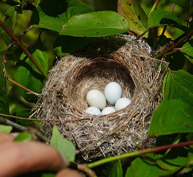

```{r}

library(kableExtra)
library(here)
library(tidyverse)

# Read in species info data:

species_info <- 
  here("data", "species_info.rds") %>% 
  read_rds() %>% 
  split(.$alpha_code)

# Custom functions --------------------------------------------------------

my_kable_style <-
  function(.kable) {
    .kable %>% 
      kable_styling(
        bootstrap_options = 
          c(
            "striped",
            "hover",
            "condensed"
          ),
        full_width = FALSE,
        font_size = 28
      )
  }

```

```{css}

/* Accordion style */

.accordion {
  margin-top: 4px;
  background-color: #e6f0ff;
  color: #000000;
  cursor: pointer;
  padding: 18px;
  width: 100%;
  border-style: solid;
  border-width: 2px;
  border-color: #ffffff;
  text-align: left;
  outline: none;
  font-size: 1.15em;
  transition: 0.4s;
}

/* When you hover your mouse over the accordion button, it changes color. */

.active, .accordion:hover {
  background-color: #80b3ff; 
  color: #ffffff;
  font-weight: bold;
}

/* This is where the content of the accordion is placed. */

.panel {
  padding: 4px 4px;
  margin-top: 1em;
  margin-bottom: 1em;
  display: none;
  background-color: #fff;
  overflow: hidden;
}
```

# Species information

<button class="accordion"> `r species_info$AGOL$common_name` (*`r species_info$AGOL$scientific_name`*)</button>

::: panel

```{r}

species_info$AGOL %>% 
  select(
    "Brood attempts" = brood_attempts,
    "Incubation" = incubation,
    "Nestling" = nestling
  ) %>% 
  kable() %>% 
  my_kable_style()

```

### Nest description

`r species_info$AGOL$nest_description`

{.intro_image}

### Egg description

```{r}

species_info$AGOL %>% 
  # unite(
  #   "egg_dimensions",
  #   c(egg_width, egg_length),
  #   sep = "x"
  # ) %>% 
  select(
    "Clutch size" = clutch_size,
    "Egg width" = egg_width,
    "Egg length" = egg_length
  ) %>% 
  kable() %>% 
  my_kable_style()

```

`r species_info$AGOL$egg_description`

:::

<script>
var acc = document.getElementsByClassName("accordion");
var i;

for (i = 0; i < acc.length; i++) {
  acc[i].addEventListener("click", function() {
  this.classList.toggle("active");
  var panel = this.nextElementSibling;
  if (panel.style.display === "block") {
    panel.style.display = "none";
  } else {
    panel.style.display = "block";
  }
  });
}

</script>

<!-- # For each species -->

<!-- Nest characteristics -->
<!-- Number of eggs -->
<!-- Number of brood attempts -->
<!-- Incubation duration -->
<!-- Nestling duration -->
<!-- Time to build nest -->
<!-- Breeding season -->
<!-- Nest picture -->
<!-- Egg picture -->